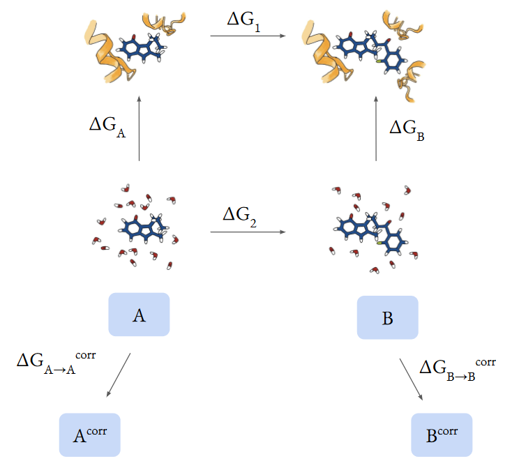

.. endstate_correction documentation master file, created by
   sphinx-quickstart on Thu Mar 15 13:55:56 2018.
   You can adapt this file completely to your liking, but it should at least
   contain the root `toctree` directive.

Welcome to endstate_correction's documentation!
=========================================================

Following an arbritary thermodynamic cycle to calculate a free energy 
for a given molecular system at a certain level of theory, we can perform 
endstate corrections at the nodes of the thermodynamic cycle to a desired 
target level of theory.
In this work we have performed the endstate corrections using equilibrium 
free energy calculations, non-equilibrium (NEQ) work protocols and 
free energy perturbation (FEP).

.. toctree::
   :maxdepth: 2
   :caption: Contents:

   getting_started
   theory
   api

Indices and tables
==================

* :ref:`genindex`
* :ref:`modindex`
* :ref:`search`
